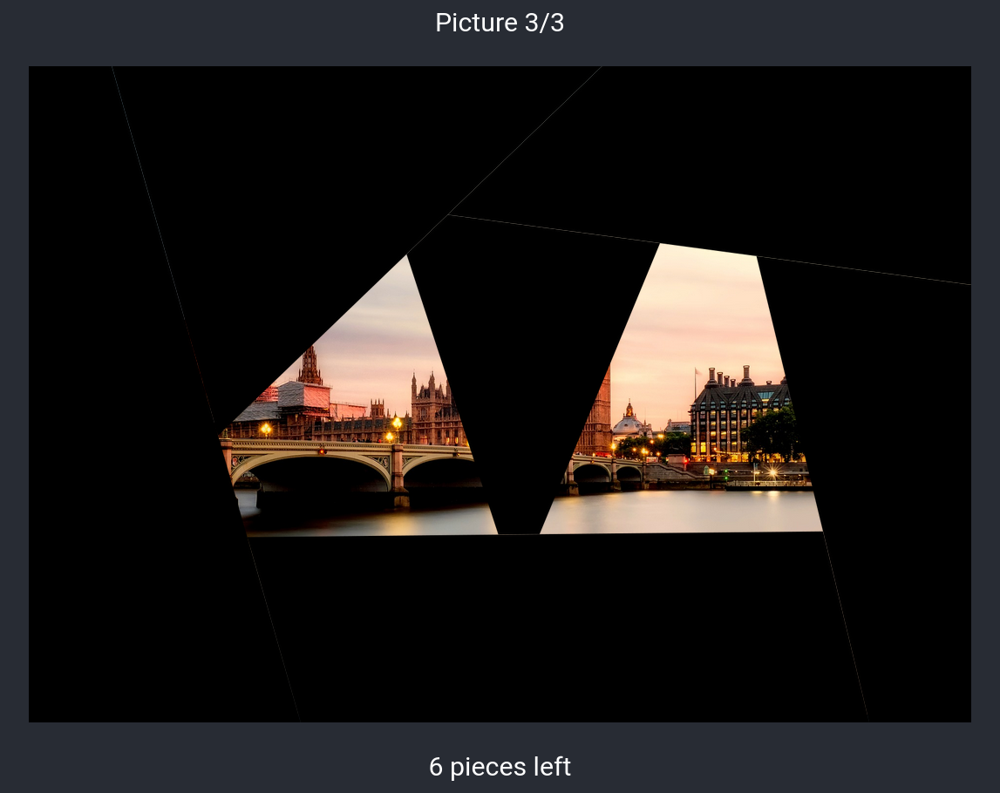

# Dalli Klick

Very simple implementation of the Dalli Klick image reveal game.
Clone the repository and install js libraries with `npm install`.
Then put a couple of images into `src/img/images` and run `npm start`.
Click to remove a random tile from the image. When all tiles are removed the image name is revealed (with no underscores and capitalized).
Have fun!

You can also [try it out](https://markus.ankenbrand.me/dalli-klick/).

## Example Images

- Paris: Image by <a href="https://pixabay.com/users/nuno_lopes-27925/?utm_source=link-attribution&amp;utm_medium=referral&amp;utm_campaign=image&amp;utm_content=975004">Nuno Lopes</a> from <a href="https://pixabay.com/?utm_source=link-attribution&amp;utm_medium=referral&amp;utm_campaign=image&amp;utm_content=975004">Pixabay</a>
- New York: Image by <a href="https://pixabay.com/users/mpewny-777390/?utm_source=link-attribution&amp;utm_medium=referral&amp;utm_campaign=image&amp;utm_content=668616">Michael Pewny</a> from <a href="https://pixabay.com/?utm_source=link-attribution&amp;utm_medium=referral&amp;utm_campaign=image&amp;utm_content=668616">Pixabay</a>
- London: Image by <a href="https://pixabay.com/users/12019-12019/?utm_source=link-attribution&amp;utm_medium=referral&amp;utm_campaign=image&amp;utm_content=2393098">David Mark</a> from <a href="https://pixabay.com/?utm_source=link-attribution&amp;utm_medium=referral&amp;utm_campaign=image&amp;utm_content=2393098">Pixabay</a>